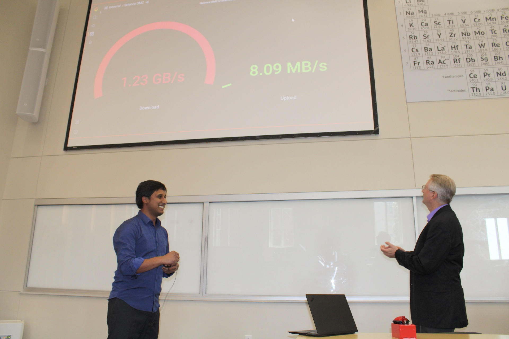
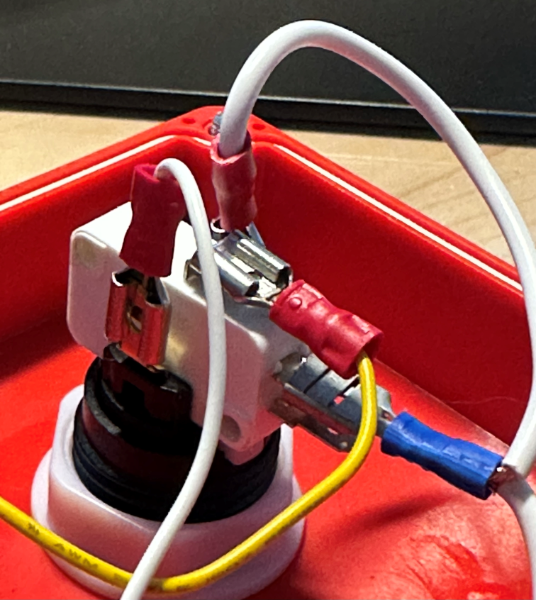
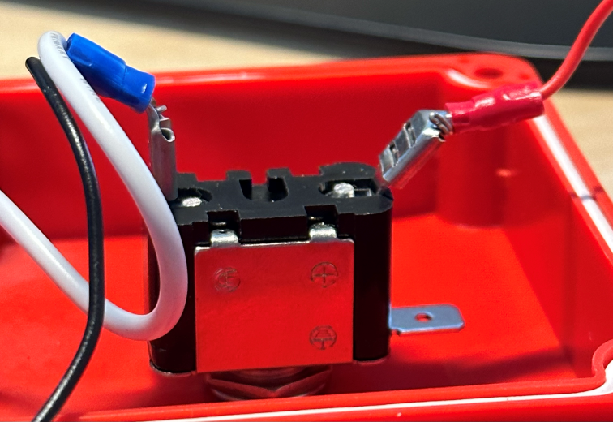

# Big Red Button

It's big.
It's red.
In this exceedingly theatric reference implementation, it'll send a Ctrl-V to whatever USB host it's connected to.
We used it at the public launch of my university's [Science DMZ](https://fasterdata.es.net/science-dmz/) to start a set of big downloads, so that the assembled VIPs could watch a Grafana bandwidth gauge redline.

## Demo Video

## Components

1. [Big Dome Pushbutton - Red](https://www.sparkfun.com/products/9181) from Sparkfun
2. [Toggle Switch and Cover - Illuminated (Red)](https://www.sparkfun.com/products/11310) from Sparkfun
3. [Big Red Box - Enclosure](https://www.sparkfun.com/products/11366) from Sparkfun
4. [Teensy®++ 2.0 Development Board](https://www.pjrc.com/store/teensypp.html) from PJRC
5. [USB-A to Mini-B 2.0 Cable](https://www.monoprice.com/product?p_id=107) from Monoprice

## Breadboard schematic

## Detail Photos

### Big Red Button

- Thin yellow wire connecting microswitch common terminal to Teensy++ B7,
- Thin white wire connecting LED anode terminal to Teensy++ D6,
- Thick white wire connecting microswitch NO terminal, LED cathode terminal, and one side of toggle switch

### Toggle Switch

- Thick white wire connecting one side of toggle switch to Big Red Button,
- Thin black wire connecting same side of toggle switch to Teensy++ GND,
- Thin red wire connecting other side of toggle switch to Teensy++ D0

## Code

Found in [big_red_dmz_button.ino](big_red_dmz_button.ino).
Should be easy to follow, and you can easily change which IO pins the switches are connected to and what key combination you want to send when they're both switched.

## TODO

- Use other digital inputs to decide if the button should send a Ctrl-V, Ctrl-Shift-V, Command-V, and possibly send an Enter key afterwards.
- 